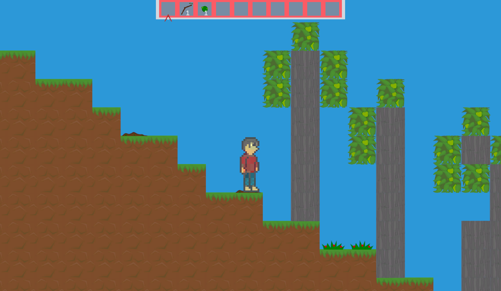
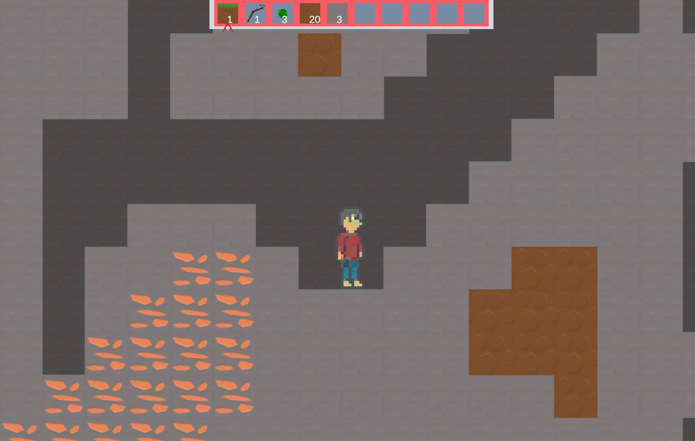

# Eiram
Eiram is a 2D procedurally generated open world game, developed in Unity

## Features
- Unique biomes including grassy hills and stone flats
- 31 items with unique crafting requirements
- Completely proceduarlly generated worlds with underground caves with valuble resources to find
- Upgradable tools with ever increasing rare materials

